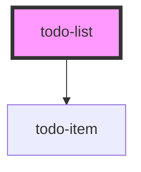

# todo-list

<!-- Auto Generated Below -->

## Properties

| Property       | Attribute | Description | Type                  | Default |
| -------------- | --------- | ----------- | --------------------- | ------- |
| `initTodoList` | --        |             | `{ todo: string; }[]` | `[]`    |

## Events

| Event        | Description | Type                               |
| ------------ | ----------- | ---------------------------------- |
| `changeList` |             | `CustomEvent<{ todo: string; }[]>` |

## Dependencies

### Depends on

- [todo-item](.)

### Graph

----------------------------------------------

*Built with [StencilJS](https://stenciljs.com/)*
